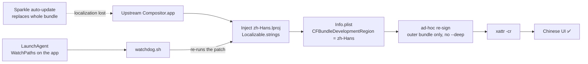

# Compositor — Simplified Chinese Localization Pack

**External injection · no upstream source changes · survives app auto-updates**

[](LICENSE)
[](https://github.com/robbietilton/Compositor)
[](docs/术语对照表.md)

[Compositor](https://github.com/robbietilton/Compositor) is a native macOS image
editor written in SwiftUI. It ships with **no localization infrastructure at all**
— every UI string is hardcoded English, there are no `.lproj` bundles, and there
is no plugin system. So this project adds Simplified Chinese from the **outside**:

> drop a `zh-Hans.lproj/Localizable.strings` into the app bundle, flip one
> `Info.plist` key, re-sign ad-hoc. **Zero upstream source changes.**

Because it only relies on the system-level `Localizable.strings` +
`CFBundleDevelopmentRegion` mechanism, upstream releases usually require nothing
more than adding a handful of new entries — the scripts themselves keep working.


> **Note:** all script output and the language pack's target language are Chinese.
> The tutorials in this README and in `docs/` are written in Chinese for the
> audience this pack serves. This file is a courtesy English overview.

---

## Highlights

- 🧩 **Non-invasive** — no fork, no source edits, official app installs normally
- 🔄 **Update-proof** — a LaunchAgent re-applies the patch after Sparkle updates
- ✅ **Keeps auto-update working** — verified end-to-end against Sparkle 2.10.0
- 📖 **Photoshop-consistent terminology** (Adobe Photoshop / Affinity Photo zh-Hans)
- 🛠 **Maintenance tooling** — one command lists new upstream strings to translate
- 🧪 **CI validation** — `.strings` syntax + format-specifier consistency

---

## Quick start

```bash
# 1. Install Compositor to /Applications (official release)
#    https://github.com/robbietilton/Compositor/releases

# 2. Clone this repo
git clone https://github.com/skyecx/compositor-zh-hans.git
cd compositor-zh-hans

# 3. Patch + install the auto-recovery watchdog
bash 一键汉化.command
```

Non-Chinese speakers can use the same command — output is in Chinese, but it only
ever asks you to press Enter. To patch without the watchdog:

```bash
bash 汉化.sh /Applications/Compositor.app            # patch
bash 汉化.sh --check /Applications/Compositor.app    # 0 = patched, 1 = needs patching
```

To revert:

```bash
bash 卸载汉化.sh
```

---

## How it works



Three things must all be right (see [`docs/研究报告.md`](docs/研究报告.md)):

1. **The `.lproj` alone is not enough.** `CFBundleDevelopmentRegion` must be set
   to `zh-Hans`, otherwise macOS still reports `preferredLocalizations = ["en"]`
   and none of the lookups resolve.
2. **Re-signing is mandatory.** The official app is Developer ID signed and
   notarized; touching its resources breaks the code-signature seal, and
   `AppleSystemPolicy` kills the process ~10 seconds after launch.
3. **No hardened runtime, no `--deep`.** An ad-hoc signature has no Team ID, so
   adding hardened runtime fails library validation; `--deep` would destroy
   `Sparkle.framework`'s genuine signature and jeopardize updates. Re-sign the
   **outer bundle only**, keeping the original entitlements.

Auto-updates are unaffected: we never touch `SUFeedURL` or `SUPublicEDKey`, and
Sparkle 2's `SUUpdateValidator` explicitly tolerates a code-signing identity
change.

---

## Files

| File | Purpose |
|---|---|
| `一键汉化.command` | **Double-click**: patch + install watchdog (recommended) |
| `汉化.sh` | The patcher itself (`--check` for dry-run) |
| `安装自动恢复.command` | Installs the LaunchAgent only |
| `watchdog.sh` | The watchdog invoked by the LaunchAgent |
| `卸载汉化.sh` | Uninstall: removes pack + plist edits + watchdog |
| `zh-Hans.lproj/Localizable.strings` | **The language pack** — 523 entries |
| `docs/研究报告.md` | Reverse-engineering notes, pitfalls, coverage analysis |
| `docs/术语对照表.md` | Full EN→ZH glossary (generated) |
| `tools/` | Maintenance tools (extract, validate, regenerate glossary) |

---

## Keeping up with upstream

```bash
git clone --depth 1 https://github.com/robbietilton/Compositor /tmp/Compositor
python3 tools/extract-missing.py /tmp/Compositor
```

Produces `missing.txt` (high-confidence UI strings that need translating),
`candidates.txt` (needs human review) and `stale.txt` (entries no longer used).
Append translations to the language pack, then:

```bash
python3 tools/check-strings.py       # syntax + placeholder consistency
python3 tools/reorganize-strings.py  # regroup into sections (translations unchanged)
python3 tools/gen-glossary.py        # regenerate the glossary
bash 一键汉化.command
```

Note: `Text("Expand by \(n) px")` needs the key `"Expand by %lld px"` — integers
use `%lld`, strings use `%@`. A mismatch fails *silently*, hence the checker.

---

## Known limitations

~95% of the UI is covered. The remaining ~5% **cannot** be covered by
`.strings` at all, because those strings are handed to SwiftUI's verbatim
`Text(_ content: some StringProtocol)` overload and never hit the bundle:

| Kind | Examples | Cause |
|---|---|---|
| enum `rawValue` dropdowns | `Normal`, `High quality`, `Exposure…`, `Gaussian Blur…` | `Text($0.rawValue)` |
| computed properties / ternaries | `Merge Down`, status-bar hints, `Result: …` | `Text(<String>)` |
| fixed unit/token strings | `px`, `RGB` | same |

Reaching 100% would require a source patch (editing `rawValue` directly would
corrupt the `.comp` file format — lookups would have to be introduced instead).

---

## Disclaimer

Scripts and translations are [MIT](LICENSE) licensed.

- This repo **does not contain or redistribute** the Compositor app. Get it from
  the [official repository](https://github.com/robbietilton/Compositor).
- This is an unofficial fan translation, **not affiliated with or endorsed by**
  the Compositor author. Compositor itself is MIT licensed, © its author.
- Patching modifies the app bundle and re-signs it — proceed at your own risk.

If this helped you, go star the [upstream project](https://github.com/robbietilton/Compositor).
