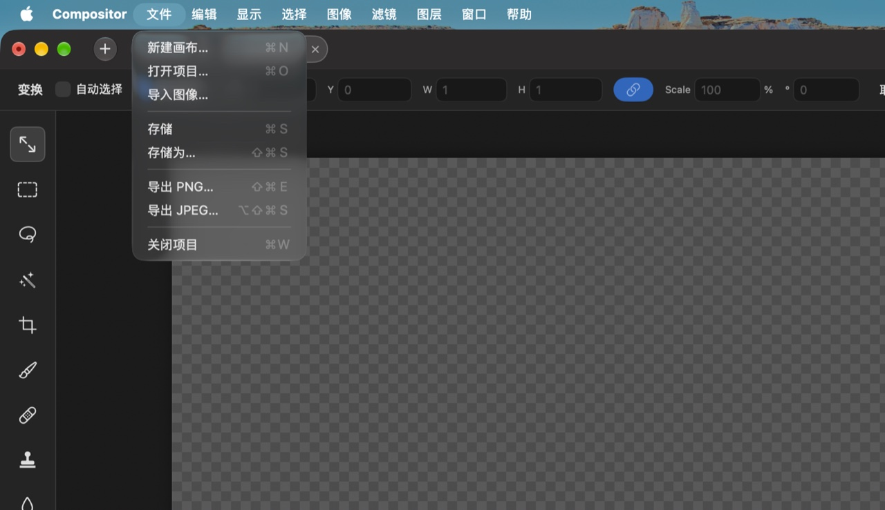
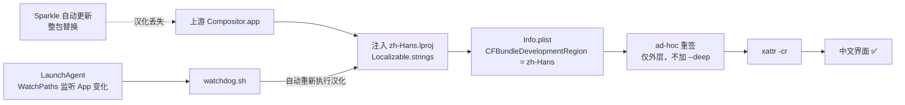

# Compositor 简体中文汉化包

**外挂式注入 · 不改上游源码 · App 自动更新后自动恢复汉化**

[](LICENSE)
[](https://github.com/robbietilton/Compositor)
[](docs/术语对照表.md)

[Compositor](https://github.com/robbietilton/Compositor) 是一个用 SwiftUI 写的原生 macOS
图像编辑器。它本身不带任何多语言支持（界面文案全部硬编码英文、没有 `.lproj`、
没有插件系统），所以本仓库用**外部注入**的方式给它加上简体中文：

> 往 App 包里塞一个 `zh-Hans.lproj/Localizable.strings`，改一个 Info.plist 字段，
> 重新做 ad-hoc 签名。**上游源码一行都不用动。**

因为只依赖「`Localizable.strings` + `CFBundleDevelopmentRegion`」这套系统级机制，
上游发新版本时通常**只需要补几条新词条**，脚本本身不用改。



---

## 特点

- 🧩 **外挂式**：不 fork、不改源码，官方 App 照常安装
- 🔄 **更新不怕**：App 被 Sparkle 自动更新覆盖后，汉化会被**自动装回来**
- ✅ **不影响自动更新**：签名与 entitlements 处理过，实测 Sparkle 更新链路正常
- 📖 **术语统一**：遵循 Adobe Photoshop / Affinity Photo 简体中文版用词
- 🛠 **自带维护工具**：上游发新版后，一条命令列出「新增了哪些待翻译词条」
- 🧪 **CI 校验**：每次提交自动检查 `.strings` 语法、占位符一致性

---

## 快速开始

**第 1 步**：从[官方 Release](https://github.com/robbietilton/Compositor/releases)安装
Compositor 到 `/Applications`（已安装的跳过）。

**第 2 步**：下载本仓库（`Code ▸ Download ZIP`，或 `git clone`）。

**第 3 步**：双击 **`一键汉化.command`**。

> 如果 macOS 提示「无法打开，因为来自身份不明的开发者」，右键点它 → **打开** →
> 再点一次**打开**即可。这是 Gatekeeper 对未签名 shell 脚本的常规拦截。

终端用户也可以手动执行：

```bash
git clone https://github.com/skyecx/compositor-zh-hans.git
cd compositor-zh-hans
bash 一键汉化.command
```

完成后打开 Compositor，菜单和面板就是中文了。

---

## 它是怎么工作的



关键点有三个，缺一个都不行（详见 [`docs/研究报告.md`](docs/研究报告.md)）：

1. **只放 `.lproj` 不够**，必须把 `CFBundleDevelopmentRegion` 改成 `zh-Hans`，
   否则 macOS 仍然认为 App 只支持英文，`preferredLocalizations` 还是 `["en"]`。
2. **改完必须重签**。原厂 App 是 Developer ID 签名 + notarize 的，动过资源后签名
   封印失效，`AppleSystemPolicy` 会在启动 10 秒左右把进程杀掉（表现为「秒退」）。
3. **重签不能加 hardened runtime、不能加 `--deep`**。ad-hoc 签名没有 Team ID，
   再叠加 hardened runtime 会导致库校验失败；而 `--deep` 会连
   `Sparkle.framework` 的原厂签名一起破坏，影响后续更新。正确姿势是**只重签外层
   App，保留原始 entitlements**。

---

## 文件说明

| 文件 | 作用 |
|---|---|
| `一键汉化.command` | **双击运行**：汉化 + 安装自动恢复守护（推荐） |
| `汉化.sh` | 实际的汉化脚本。支持 `--check` 只检查不改 |
| `安装自动恢复.command` | 单独安装 LaunchAgent 守护（`一键汉化` 已包含） |
| `watchdog.sh` | 守护脚本本体，被 LaunchAgent 调用 |
| `卸载汉化.sh` | 移除语言包、恢复 Info.plist、卸载守护 |
| `zh-Hans.lproj/Localizable.strings` | **语言包本体**，523 条词条 |
| `docs/研究报告.md` | 逆向过程、踩坑记录、覆盖率分析 |
| `docs/术语对照表.md` | 全部词条的中英对照（自动生成） |
| `tools/` | 维护工具（提取新词条、校验、生成对照表） |

---

## App 更新后怎么办

### 自动（默认，装了守护就有）

`一键汉化.command` 会安装一个 LaunchAgent，它监听
`/Applications/Compositor.app` 的变化。Sparkle 更新完 App 后，守护脚本会自动
把汉化重新装回去：

```bash
# 看守护日志
tail -f ~/Library/Logs/compositor-hanhua.log

# 看守护是否在跑
launchctl print gui/$UID/com.wonderassembly.compositor.hanhua | head -5
```

### 手动

```bash
bash 汉化.sh            # 自动找 /Applications/Compositor.app
bash 汉化.sh --check    # 只检查状态（已汉化返回 0，需要汉化返回 1）
```

---

## 上游发新版了，怎么补新词条

这是本项目最常用的维护动作：

```bash
# 1. 拉一份上游新代码
git clone --depth 1 https://github.com/robbietilton/Compositor /tmp/Compositor

# 2. 扫出「源码里有、语言包里没有」的词条
python3 tools/extract-missing.py /tmp/Compositor
```

输出三个文件：

| 文件 | 含义 |
|---|---|
| `missing.txt` | **高置信度**：来自 `Text("…")` / `Label("…")` 等明确的本地化调用点，就是要补翻译的 |
| `candidates.txt` | 低置信度：其它字符串字面量，需要人工挑 |
| `stale.txt` | 语言包里已失效的词条，可以删 |

把 `missing.txt` 里的词条翻译好、追加到 `zh-Hans.lproj/Localizable.strings`，然后：

```bash
python3 tools/check-strings.py      # 语法 + 占位符一致性校验
python3 tools/reorganize-strings.py # 按功能分区重排（译文不变）
python3 tools/gen-glossary.py       # 重新生成术语对照表
bash 一键汉化.command                # 装到 App 上验证
```

> **关于占位符**：源码里的 `Text("Expand by \(n) px")` 对应的 key 是
> `"Expand by %lld px"`。整数用 `%lld`，字符串用 `%@`。写错的话该词条会静默失效
> （不报错，只是不生效），所以务必跑 `check-strings.py`。

---

## 已知限制

**约 95% 的界面文本**能通过语言包覆盖。剩下约 5% 的文本**在原理上无法**用
`.strings` 覆盖，因为它们走的是 SwiftUI 的「逐字渲染」通道（`Text(_ content: some
StringProtocol)` 重载），压根不会去查语言包。典型的有：

| 类别 | 例子 | 原因 |
|---|---|---|
| 枚举 `rawValue` 派生的下拉项 | `Normal`、`High quality`、`Exposure…`、`Gaussian Blur…` | `Text($0.rawValue)` |
| 计算属性 / 三元表达式 | `Merge Down`、状态栏提示句、`Result: …` | `Text(<String>)` |
| 单位、通道等固定短串 | `px`、`RGB` | 同上 |

想覆盖这部分只有改源码重编译（改 `rawValue` 会破坏 `.comp` 文件格式，必须改成
查表）。详见 [`docs/研究报告.md`](docs/研究报告.md) 的「A 类 vs B 类」一节。

---

## 常见问题

**Q：装完打开还是英文？**

先确认 App 位置：`bash 汉化.sh --check`。如果用 `open -n` 直接跑二进制可能绕过
LaunchServices 的语言协商，正常双击打开即可。

**Q：App 打开后 10 秒左右自动退出（秒退）？**

签名封印被破坏了。重跑一次 `bash 汉化.sh`（它会重新 ad-hoc 签名）。

**Q：提示没有写入权限？**

macOS 14+ 往 `/Applications` 写文件需要授权。到
**系统设置 › 隐私与安全性 › App 管理**，把「终端」（或你用的终端 App）打开。
或者把 Compositor 装到 `~/Applications` 再汉化。

**Q：会影响 Compositor 自动更新吗？**

不会。已实测：汉化后 Sparkle 仍能正常拉取 appcast 并检查更新。
原理见研究报告（Sparkle 2 的 `SUUpdateValidator` 允许签名主体变化，而
`SUPublicEDKey` 我们没有动）。

**Q：能改回英文吗？**

`bash 卸载汉化.sh`。注意原厂的 Developer ID 签名无法还原（重签是单向的），
想要一个「和官方一模一样」的 App 请从官方 Release 重新下载。

---

## 贡献

欢迎提 PR 修翻译。最需要帮忙的是：

1. **用语纠错** —— 觉得哪个词不符合 Photoshop 习惯，直接改
   `zh-Hans.lproj/Localizable.strings` 并跑一遍 `tools/` 里的校验脚本。
2. **补 B 类字符串** —— 如果你愿意维护一个「源码补丁」，让覆盖率到 100%，非常欢迎。
3. **适配新版本** —— 上游发新版后跑一次 `tools/extract-missing.py`，把新词条补上。

提交前请确保：

```bash
python3 tools/check-strings.py      # 必须通过
python3 tools/gen-glossary.py       # 对照表要同步提交
```

---

## 许可与免责声明

本仓库的脚本和语言包以 [MIT](LICENSE) 协议开源。

- 本仓库**不包含、不分发** Compositor 本体程序，请从[官方渠道](https://github.com/robbietilton/Compositor)获取。
- 本项目是第三方爱好者作品，**与 Compositor 官方无隶属关系**，也未获其背书。
- Compositor 本身也是 MIT 协议，版权归其作者所有。
- 汉化会修改 App 包内容并重新签名，请自行评估风险。
- 更详细的权属说明见 [NOTICE.md](NOTICE.md)。

如果这个项目帮到了你，记得去给[上游](https://github.com/robbietilton/Compositor)
点个 ⭐。
