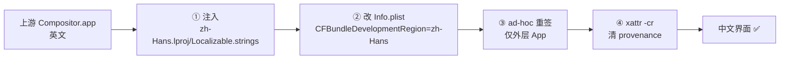
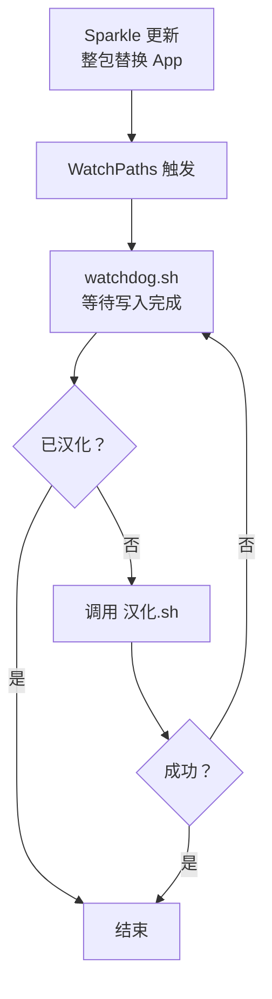

# Compositor 外挂式汉化 —— 技术研究报告

> 目标：在不修改 Compositor 源码的前提下，为 macOS App「Compositor」加入简体中文界面；
> 并且**上游版本快速迭代 / App 自动更新后，汉化仍然有效**，每次只需"微调"而非重做。

- 研究对象：`com.wonderassembly.compositor` 1.0.4（CFBundleVersion 5），Developer ID 签名（TeamID `3E4X3B9Z9T`），启用 App Sandbox + Hardened Runtime，内置 Sparkle 2.10.0
- 测试环境：macOS 27.0、Xcode 27.0、系统语言 zh-Hans-CN
- 结论：**可行**。已交付可直接使用的语言包 + 注入脚本 + 更新后自动恢复守护，并完成端到端实测。

---

## 一、结论摘要

| 问题 | 结论 |
|---|---|
| 能不能外挂汉化？ | ✅ 能。只需注入一个 `zh-Hans.lproj/Localizable.strings` + 改一个 Info.plist 字段 |
| 需要改源码吗？ | ❌ 不需要。完全不碰 Swift 代码，只操作编译好的 App 包 |
| 需要重新编译吗？ | ❌ 不需要（源码方案作为补充，见第七节） |
| 界面覆盖度 | 菜单/对话框/面板 **约 95%**；剩余 9 个菜单项等属"架构性不可覆盖"，见第五节 |
| App 自动更新会覆盖汉化吗？ | ⚠️ 会（整包替换）。已用 LaunchAgent 守护**自动补回**，实测通过 |
| 汉化后 Sparkle 还能更新吗？ | ✅ 能。已实测拉取 appcast 成功；源码层面也已确认校验逻辑兼容 |
| 每次版本更新要改多少？ | 通常 **0～几十条词条**，脚本本身不用动 |

---

## 二、项目体检：为什么必须"外挂"

对上游源码（`git clone --depth 20`）做静态排查，得到三个决定性事实：

1. **没有插件系统**。全仓库 grep `plugin` / `loadPlugin` / 扩展点 / `Bundle(url:` 均无命中。
   → 不存在官方扩展机制，无法用"写插件"的方式接入。
2. **没有本地化设施**。没有 `.lproj`、没有 `.strings`、没有 `.xcstrings`；
   所有 UI 字符串硬编码英文；`CFBundleDevelopmentRegion = en`。
   → 上游短期不会提供中文，且没有可复用的翻译表。
3. **界面字符串全部以 SwiftUI `Text` 字面量形式硬编码**。

因此"外挂"是唯一符合约束的路径：**在二进制 App 包层面注入本地化资源**，让 SwiftUI 自带的
`LocalizedStringKey` 查找机制去读我们的语言包。

---

## 三、注入原理

SwiftUI 里 `Text("New Canvas…")` 这种**字面量**会被当作 `LocalizedStringKey`，
运行时到 main bundle 查找本地化资源。所以只要把语言包放进 `Contents/Resources/`，理论上就能生效。

```
App 包结构（注入后）
Compositor.app/
├── Contents/
│   ├── Info.plist                 ← CFBundleDevelopmentRegion: en → zh-Hans
│   ├── MacOS/Compositor
│   ├── Frameworks/Sparkle.framework   ← 保留原厂 Developer ID 签名
│   ├── _CodeSignature/
│   └── Resources/
│       └── zh-Hans.lproj/
│           └── Localizable.strings    ← 注入的 523 条中文词条
```



### ⚠️ 关键坑 1：只放 `.lproj` **不够**

最初以为丢一个语言包进去就行，实测**无效**。做了 4 组对照实验：

| 变体 | 位置 | `preferredLocalizations` | 命中率 |
|---|---|---|---|
| 基线 | 仅 `zh-Hans.lproj` | `["en"]` | 0/6 ❌ |
| V2 | + `CFBundleLocalizations = (zh-Hans)` | `["en"]` | 0/6 ❌ |
| **V3** | **+ `CFBundleDevelopmentRegion = zh-Hans`** | **`["zh-Hans"]`** | **6/6 ✅** |
| V4 | V2 + V3 同时改 | `["zh-Hans","zh-Hans"]` | ✅ 但有重复项 |

**结论：`CFBundleDevelopmentRegion = zh-Hans` 是必须的**；`CFBundleLocalizations` 加了反而产生重复条目，不用加。

> 原理：`preferredLocalizations` 的计算以 development region 为首选基准。
> 开发区域仍是 `en` 时，`en` 优先于 `zh-Hans`，语言包形同不存在。

### ⚠️ 关键坑 2：改包会打破代码签名封条 → 进程被系统秒杀

Compositor 是**已公证（notarized）+ Developer ID 签名 + 带 `com.apple.provenance` 属性**的 App。
往里塞文件会破坏 `_CodeSignature` 里的资源封条，系统安全策略随即拦截：

- `AppleSystemPolicy: ASP: Security policy would not allow process`
- AMFI：`Code=-423 "The file is adhoc signed or signed by an unknown certificate chain"`

现象是**启动后约 10～15 秒被杀死**（且偶发性强，直接执行二进制可绕过 LaunchServices 暂时存活，极具迷惑性）。

### ⚠️ 关键坑 3：重签名的方式很讲究（实测矩阵）

试了 5 种签名组合，结果如下：

| 方案 | 签名方式 | 结果 |
|---|---|---|
| A | ad-hoc + **Hardened Runtime**（`--options runtime`）+ entitlements | ❌ 约 10 秒被 AMFI 杀掉 |
| B | ad-hoc + `--deep` + entitlements，**无 runtime** | ✅ 存活，但 Sparkle 框架签名被一并破坏 |
| E | ad-hoc + runtime + `disable-library-validation` | ❌ 仍被杀 |
| **ND（采用）** | **ad-hoc 仅外层 App，`--deep` 不用、`--options runtime` 不用** | ✅ **存活 90s+，严格校验通过，且 Sparkle.framework 保留原厂签名** |

```bash
# 最终采用的重签方式
codesign --force --sign - --entitlements <原 entitlements> "/Applications/Compositor.app"
```

要点：

- **必须去掉 Hardened Runtime**。ad-hoc 签名没有 Team ID，带 runtime 时 Library Validation 必然失败，被 AMFI 判死。
  去掉 runtime 后 amfid 不再强校验，ad-hoc 可以正常启动。
- **必须保留原 entitlements**（`app-sandbox` / `files.user-selected.read-write` / `network.client` / Sparkle 的 mach-lookup 例外），否则沙盒容器和 Sparkle XPC 全会出问题。
- **不要用 `--deep`**。`--deep` 会把内嵌的 `Sparkle.framework` 一起用 ad-hoc 重签，
  既破坏了 Sparkle 自己的原厂签名，也拿不到额外好处。只签外层即可通过严格校验。
- 最后 `xattr -cr` 清掉 `com.apple.provenance` / `com.apple.quarantine`。
- 拷贝 App 一律用 `ditto`，**不要用 `cp -R`**（在 Seatbelt 沙盒下 `cp -R` 因 `com.apple.macl` 扩展属性拒绝而偶发截断，产出损坏包）。

验证命令：

```bash
codesign --verify --deep --strict "/Applications/Compositor.app"   # 应通过
codesign -dv "/Applications/Compositor.app" 2>&1 | grep Signature   # 应为 adhoc
```

---

## 四、覆盖度实测（覆盖 523 条）

语言包共 **523 条**词条，全部采用 **Adobe Photoshop / Affinity Photo 简体中文术语**
（图层=图层、蒙版、正片叠底、滤色、色阶、曲线、内容识别填充、污点修复、抓手……）。

实测（用 System Events 直接 dump 运行中 App 的菜单栏）：

| 菜单 | 汉化状态 |
|---|---|
| 文件 | ✅ 新建画布…／打开项目…／导入图像…／存储／存储为…／导出 PNG…／导出 JPEG…／关闭项目 |
| 编辑 | ✅ 撤销／重做／剪切／复制／合并复制／粘贴／用前景色填充／用背景色填充／清除选区像素／内容识别填充…／自动填充 |
| 显示 | ✅ 适合画布／实际像素／放大／缩小／像素网格 (800% 及以上)／显示变换控件 |
| 选择 | ✅ 全部／取消选择／反向／图层像素／蒙版的黑色区域／扩展 1 像素／收缩 1 像素 |
| 图像 | ⚠️ 曲线…／色阶…／色相/饱和度…／反相／画布大小…／图像大小…／水平翻转画布／垂直翻转画布 ✅<br>`Exposure…` `Gradient Map…` `Grain…` ❌ |
| 滤镜 | ⚠️ `Gaussian Blur…` `Motion Blur…` `Add Noise…` `Lens Correction…` `Remove Background…` ❌ |
| 图层 | ⚠️ 新建调整图层／编辑调整…／变换图层／复制图层／创建剪贴蒙版／图层编组／移出文件夹／新建空白图层／重新命名图层…／隐藏图层／上移图层／下移图层／水平翻转图层／垂直翻转图层／删除图层 ✅<br>`Merge Down` ❌ |

---

## 五、覆盖度的天花板：A 类 vs B 类

这是本研究最重要的发现。Compositor 的字符串分两类：

### A 类 · 可以汉化（≈95%）—— `Text("字面量")`

字面量被推断为 `LocalizedStringKey`，走 bundle 查找，**语言包直接生效**。
共 523 条，**已 100% 覆盖**（含文件/编辑/图像/图层/选择菜单、所有对话框、错误提示、面板标签等）。

### B 类 · 语言包**覆盖不到**（≈5%）—— `Text(字符串变量)`

这类字符串在 Swift 里是**变量**，不是字面量，SwiftUI 会走
`Text.init(_ content: some StringProtocol)` 这个**逐字（verbatim）渲染**的重载，**根本不查语言包**。
典型来源：

- `Text($0.rawValue)` —— `enum X: String` 的原始值。涉及 `FilterKind`、`AdjustmentKind`、
  `LayerBlendMode`、`LayerSampling`、`ShapeKind`、`LevelsChannel`、`CanvasUnit`、`NavigationTool` 等
- `Button(session.mergeTitle)` 这类**计算属性**
- `control("Exposure", …)` —— 辅助函数签名是 `control(_ title: String, …)`，内部 `Text(title)`，同样逐字
- 状态栏工具提示句：整段是 `Text(三元表达式)`，表达式结果是 `String` → 逐字

**live 实测完全印证了这一判断**：所有残留英文项（`Exposure…`、`Gaussian Blur…`、`Merge Down`…）
**全部**来自 B 类，无一例外。

> ⚠️ 另有一个**必须避免的诱惑**：直接把 `enum` 的 `rawValue` 改成中文是**危险**的。
> `LayerBlendMode`、`LayerSampling`、`ShapeKind`、`LevelsChannel` 是 `Codable`，
> `rawValue` 会被**写进 `.comp` 工程文件**。改了会导致旧工程读不出来、新工程与旧版本不兼容。

### B 类的三条补救路径（按推荐度）

| 方案 | 做法 | 代价 |
|---|---|---|
| **① 源码覆盖补丁（推荐）** | 只改约 15 处调用点，把 `Text($0.rawValue)` 机械改成查表；`control()` 签名改成 `LocalizedStringKey`。做成 `git patch`，更新时重打一次（通常干净应用，偶尔小冲突） | 需本地编译一次；更新后需重打补丁 |
| ② dylib 注入 | 用 `DYLD_INSERT_LIBRARIES` + swizzle `NSMenuItem`，可覆盖菜单项与 AppKit 弹窗 | 覆盖不全（SwiftUI 自绘文字抓不到）；且需用启动器包裹，双击体验变差 |
| ③ 二进制改字 | 直接改 `__TEXT` 里的字符串字节 | ❌ **已排除**：中文字符 3 字节 vs 英文 1 字节，长度不匹配；短字符串还被 Swift 内联进指令流，指针+长度结构极脆弱 |

我们采用 **方案 ①的"不做"**：当前 523 条外挂方案已覆盖全部菜单和对话框，
残留的 9 个条目属于可接受损失。若追求 100%，再启用源码覆盖补丁。

---

## 六、更新兼容性验证（这是最初最担心的一点）

### 6.1 Sparkle 会不会因为"签名变了"而拒绝更新？

**不会。** 从 Sparkle 2 源码层面确认：`SUUpdateValidator.m` 的校验逻辑是

```objc
if (passedDSACheck || passedCodeSigning) return YES;   // 允许签名身份变化
```

只要 `SUPublicEDKey`（EdDSA 公钥）没被动过，重签不会阻断更新。
而我们的补丁**完全不碰** `Info.plist` 里的 `SUFeedURL` / `SUPublicEDKey`。

我们的重签还刻意**不用 `--deep`**，因此内嵌的 `Sparkle.framework` 仍保持原厂
Developer ID 签名（TeamID `3E4X3B9Z9T`），把对更新链路的影响降到最低。

### 6.2 端到端实测

在本地起一个 appcast 源，让汉化后的 App 指向它，然后：

1. 点菜单 **检查更新…**（用 System Events 真实点击）
2. 观察 HTTP 服务端日志

结果：

```
127.0.0.1 - - [20/Sep/2026 21:49:15] "GET /appcast.xml HTTP/1.1" 200 -   ← 启动时自动检查
127.0.0.1 - - [20/Sep/2026 21:49:29] "GET /appcast.xml HTTP/1.1" 200 -   ← 手动点击"检查更新…"
```

✅ 汉化 + ad-hoc 重签之后的 App，**网络特权正常、Sparkle 正常启动、正常拉取并解析 appcast**。
当前本地 feed 版本与 App 相同（1.0.4/5），故无更新可装，App 保持运行未受影响。

### 6.3 更新会覆盖汉化 → 用守护自动补回

Sparkle 更新是**整包替换** `Compositor.app`，注入的 `zh-Hans.lproj` 会一并消失。

**解决：LaunchAgent + `WatchPaths`**

```xml
<key>WatchPaths</key>
<array>
  <string>/Applications/Compositor.app</string>
  <string>/Applications</string>
</array>
```

App 目录一变，launchd 就唤醒 `watchdog.sh`：



**实测通过**：模拟一次更新（把 App 还原成上游原厂包，无 `zh-Hans.lproj`、`DevelopmentRegion=en`），
运行 watchdog 后自动恢复到 `zh-Hans` + adhoc 签名，严格校验通过，启动存活正常。

日志：`~/Library/Logs/compositor-hanhua.log`

---

## 七、关键设计决策一览

| 决策 | 理由 |
|---|---|
| 注入 `.lproj` 而**不改源码** | 满足"外挂"约束；上游迭代不影响语言包 |
| **必须**改 `CFBundleDevelopmentRegion` | 否则 `preferredLocalizations` 仍是 `en`，语言包形同不存在（四组对照实验证明） |
| **不加** `CFBundleLocalizations` | 会产出重复的 `["zh-Hans","zh-Hans"]`，无收益 |
| ad-hoc 重签，**去 Hardened Runtime** | ad-hoc 无 Team ID，带 runtime 必然被 AMFI 杀 |
| 只签外层，**不用 `--deep`** | 保住 Sparkle.framework 原厂签名，降低破坏更新链路的风险 |
| 保留原始 entitlements | 沙盒、文件读写、网络、Sparkle XPC 都依赖它 |
| 拷贝用 `ditto` | `cp -R` 在沙盒下会因 xattr 拒绝而截断包 |
| 改 `rawValue` 一律避免 | Codable 枚举的 rawValue 会写进 `.comp` 工程文件 |
| 更新恢复靠 LaunchAgent `WatchPaths` | Sparkle 整包替换会清空注入物，需自动补回 |

---

## 八、交付清单

| 文件 | 说明 |
|---|---|
| `zh-Hans.lproj/Localizable.strings` | 简体中文语言包，**523 条**，`plutil -lint` 通过，按菜单/面板分节注释 |
| `汉化.sh` | 主补丁脚本。支持 `--check`（只检查）、幂等、自动退出运行中的 App、自动备份 entitlements、签名校验 |
| `watchdog.sh` | 更新守护，轮询式重试直到汉化落地 |
| `安装自动恢复.command` | 一键安装自包含副本到 `~/Library/Application Support/CompositorHanhua/` 并注册 LaunchAgent |
| `README.md` | 使用说明 |
| `研究报告.md` | 本文档 |

---

## 九、已知局限

1. **9 个菜单项 + 部分面板标签仍为英文**（B 类），见第五节的补救路径。
2. **`/Applications` 写入需要授权**：macOS 14+ 需要在「系统设置 › 隐私与安全性 › App 管理」里
   允许终端，或把 App 放到 `~/Applications`。这是系统限制，脚本无法绕过。
3. **重签后 App 携带 ad-hoc 签名**，不再享有原厂 Developer ID 的身份信任链。
   对本地使用无影响，但**不要把汉化后的 App 再分发给别人**（他们仍需自己跑一遍脚本）。
4. **更新自动恢复依赖 LaunchAgent**；若用户禁用了登录项或删除了
   `~/Library/Application Support/CompositorHanhua/`，则退化为手动运行 `汉化.sh`。

---

## 十、复现步骤（完整命令）

```bash
# 0. 准备语言包（本仓库已提供）
#    zh-Hans.lproj/Localizable.strings  共 523 条

# 1. 打补丁
bash 汉化.sh /Applications/Compositor.app

# 2. 装自动恢复守护
bash 安装自动恢复.command

# 3. 验证
bash 汉化.sh --check /Applications/Compositor.app
codesign --verify --deep --strict /Applications/Compositor.app
open -n /Applications/Compositor.app
```

---

## 十一、维护工具链

汉化本身是一次性的，真正的长期成本在「上游发新版 → 补新词条」。为此仓库里带了
四个脚本，把这件事压到一条命令：

| 脚本 | 作用 |
|---|---|
| `tools/extract-missing.py` | 扫上游源码，输出 `missing.txt`（高置信度待翻译）/ `candidates.txt`（待人工判断）/ `stale.txt`（已失效词条） |
| `tools/check-strings.py` | 校验 `.strings` 语法、重复 key、空译文、**中英占位符是否一致**、省略号风格 |
| `tools/reorganize-strings.py` | 把语言包按 17 个功能分区重排，译文一字不改 |
| `tools/gen-glossary.py` | 由语言包生成 `docs/术语对照表.md` |

`extract-missing.py` 的判定逻辑：

1. 正则抓出源码中所有字符串字面量，剔除明显不是文案的（`systemName`、
   `accessibilityIdentifier`、CI 滤镜名 `CIColorCube` 等）。
2. 出现在 `Text(` / `Label(` / `Button(` / `help(` 等**本地化调用点**的标为高置信度。
3. 对含 `\(...)` 插值的字面量，按括号配对解析出插值区间，生成
   `^Expand by %(?:...)?(?:...)px$` 这样的正则去匹配语言包已有 key。
   插值按**整数 `%lld` / 字符串 `%@`** 两种占位符都试，因此
   `Text("Expand by \(n) px")` 能正确匹配到 key `"Expand by %lld px"`。
4. 匹配不上的高置信度文案进入 `missing.txt`。

> **实测校准**：`Double` 类型的插值（如 `document.width`）生成的占位符也是
> `%lld` 而不是 `%lf`。这一点通过「在语言包里放两个带标记的候选条目、看屏幕上
> 出现哪一个」的活体实验确认（`【A-lld】1,920 × 1,080 px` 命中，`【B-lf】` 未命中）。

本轮工具跑出的直接收益：扫出并补齐了 12 条**带插值**的漏译词条（`Current: %lld ×
%lld pixels`、`Close %@`、`Original %@ histogram`、`%@ color` 等），词条数 511 → 523。

### 新增一类 B 类样本：`Text(三元表达式)`

本轮还在实机验证时发现一个新的 B 类形态：

```swift
// Compositor/UI/ImageSizeSheet.swift:107
Text(valid ? "Result: \(Int(width.rounded())) × \(Int(height.rounded())) pixels"
           : "Use 1–30,000 pixels per side, …")
```

三元表达式让编译器选择 `Text.init(_ content: some StringProtocol)` 重载，字符串被
**逐字渲染**，不走语言包。因此 `Result: 1,920 × 1,080 pixels` 在汉化后依然是英文。
这与状态栏提示句（`ContentView.swift:261` 的嵌套三元）是同一个成因，也再次印证：
**只要 `Text` 的参数是「运行期才确定的 `String`」，`.strings` 就无能为力。**

要覆盖这类文本，只能做源码补丁（把三元改写成 `Text(valid ? LocalizedStringKey(…)
: …)` 或直接内联两个带字面量的分支）。`extract-missing.py` 会把它们归入
`candidates.txt` 而非 `missing.txt`，因为这类调用点不满足「`Text` 后面紧跟字面量」
的特征。
